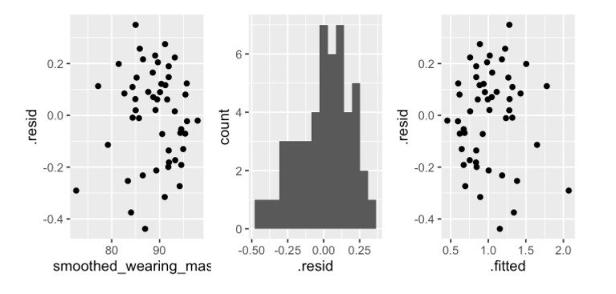

# Linear Regression: An Overview

Linear modeling is a fundamental aspect of statistics. One of the most ubiquitous predictive modeling methods, linear regression, is useful for its simplicity in implementation and interpretation. While linear regression is used to predict the value of a continuous response variable *Y* as a function of one or more explanatory variables *X* using a mathematical function, this technique operates with several underlying assumptions and is sensitive to outliers. 

Linear regression is useful for analyzing relationships among variables of interest and determining whether there is a linear or non-linear association among them, which is essential for exploratory data analysis and in choosing suitable models. To check whether the data we are attempting to model is suitable for linear regression, we must examine four assumptions which are summarized as **L.I.N.E**:

  + **L**inear relationship [between the *X* and *Y* variables]
  + **I**ndependent observations [there is no relationship between the residuals and predictor variable(s)]
  + **N**ormal residuals [the distribution should be *symmetric*, *unimodal*, and approximately *bell-shaped*]
  + **E**qual variance in residuals [there is no relationship between the residuals and fitted values]
  
The mathematical equation of linear regression can be modeled as:

$Y = \beta_1 + \beta_2X + \epsilon$

where $\beta_1$ represents the intercept, $\beta_2$ signifies the slope, and $\epsilon$ stands for the error term. $Y$ is the outcome variable, which is predicted by $X$ as the input variable. Furthermore, there can be multiple $X$ variables that are either continuous or categorical (i.e. $X_2$, $X_3$, etc.).

---

As an example, we will examine the Needle Exchange Data, a dataset gathered from **amFAR** (the Foundation of AIDS Research), to analyze how the distance to nearest syringe program (```dist_SSP```) relates to percent uninsured (```pctunins```). In the following overview, we will walk through how to perform **EDA** (Exploratory Data Analysis), review the **L.I.N.E.** assumptions,and fit the linear model to the data. In addition, we will provide guidance on data visualization and plot aesthetics. For the purpose of this example, we will only analyze the two variables mentioned above. Although it is relatively simple to add more explanatory variables to a linear model, analyzing and graphing the data can quickly become complicated. For further information, see this tutorial on Multivariate Regression: <https://openintro.shinyapps.io/ims-04-multivariable-and-logistic-models-03/#section-multiple-regression>

# Importing the Data

To preface this overview, we must install and load the following packages into R:

  + ```tidyverse```
  + ```tidymodels```
  + ```patchwork```
  + ```moderndive```
  + ```GGally```
  + ```readxl```
  
First, load the data:

*Note: You might have to specify the file path to the data if it is not uploaded to a folder that you can directly access from your 'Home' page as is shown below.*

To download these files to follow along with the exercise, go to this [GitHub page]("https://github.com/Eli2022/Personal-Projects/blob/main/Project_Linear_Regression_Lesson/dist_ssp_amfar.csv") for the `.csv file` and [this page]("https://github.com/Eli2022/Personal-Projects/blob/main/Project_Linear_Regression_Lesson/opioid_county_codebook.xlsx") for the `.xlsx file`.


```{r, message = FALSE}
library(tidyverse)
library(tidymodels)
library(patchwork)
library(moderndive)
library(GGally)
library(readxl)
needex = read_csv("dist_ssp_amfar.csv")
needex_codebook <- read_excel("opioid_county_codebook.xlsx", sheet = "Dictionary")
#It might be easier to open and read the .xlsx file in Excel rather than in R
```


We named the Needle Exchange Data as ```needex``` and will refer to it henceforth when calling the data. The ```needex_codebook``` contains a description for the variable names used in ```needex``` (as well as many others). You can locate the variable names quickly in the codebook by searching using **Ctrl + F**.


---


# EDA


To start off, we should observe the variable types in the dataset:


```{r EDA}
head(needex)
```


Using the ```head()``` function, we can observe the first 6 rows and each variable name in the dataset. You may also specify the number of rows of data shown using ```n = ...```, but the default is 6 rows.

Notice that we have three categorical variables: ```county```, ```STATEABBREVIATION```, and ```metro```. Our four numerical variables are as follows: ```dist_SSP```, ```HIVprevalence```, ```opioid_RxRate```, and ```pctunins```.

You could check the ```needex_codebook``` for the descriptor for each variable, but for the sake of brevity we will clarify several of the variables:

  + ```dist_SSP``` = distance to nearest syringe services program (in miles)
  + ```HIVprevalence``` = # living people diagnosed w/ HIV per 100,000 (including adults and adolescents 13+)
  + ```opioid_RxRate``` = # opioid prescriptions per 100 people
  + ```pctunins``` = % civilian population (not in an institution) w/o health insurance coverage
  + ```metro``` = whether the geographical location is considered metropolitan or not *(NOTE: This is a personal interpretation because the ```needex_codebook``` did not provide a definition)*

We can then create a *pairs plot* - using the ```GGally``` package - to display a scatterplot matrix of all the quantitative variables from the ```needex``` dataset.


```{r Pairs Plot, message = FALSE}
needex %>%
  select(dist_SSP, HIVprevalence, opioid_RxRate, pctunins) %>%
GGally::ggpairs(lower = list(continuous = wrap("smooth", size=0.1)))
```


Looking at the *pairs plot*, it appears that the strongest correlation of **0.0.413** among the quantitative variables is between  ```dist_SSP``` and ```pctunins``` (shown at the top right) while the scatterplot of that relationship is displayed in the bottom left. Typically, a correlation coefficient between 0.3 to 0.7 is considered to be of *moderate* strength. Thus, we can say that the relationship between ```dist_SSP``` and ```pctunins``` is a *positive*, moderate correlation.

While you knew from earlier that we were going to analyze the relationship between ```dist_SSP``` and ```pctunins```, we have shown through **EDA** how you can explore the relationships among your variables to determine which variables are appropriate to focus on and model further.

The code for producing a scatterplot of ```dist_SSP``` and ```pctunins``` is shown:


```{r Scatterplot}
needex %>%
  ggplot(aes(x = pctunins, y = dist_SSP)) +
  geom_point() 

```

---

# Plotting the Data

Does the scatterplot above seem a bit hard to interpret without context? It should. In R, you can visualize your graph in countless ways - adjusting the parameters, changing the titles and labels, layering ```geoms``` and ```aesthetics```, adding colors and gradients and shapes and text, etc. We should start by changing the labels of the x- and y-axis to more appropriate titles.


```{r,  message = FALSE}
needex %>%
  ggplot(aes(x = pctunins, y = dist_SSP)) +
  geom_point() +
  labs(title = "Modeling the Strongest Correlation of 'needex'",
       x = "Percent Uninsured",
       y = "Distance to Nearest Syringe Programs (mi)",
       caption = "Source: amFAR") #Caption is placed automatically to bottom right
```


To make the plot more aesthetically pleasing, you may also use the ```theme()``` function to adjust the size, color, font, and remove/add other features of the text in the labels.


```{r}
needex %>%
  ggplot(aes(x = pctunins, y = dist_SSP)) +
  geom_point() +
  labs(title = "Modeling the Strongest Correlation of 'needex'",
       x = "Percent Uninsured",
       y = "Distance to Nearest Syringe Programs (mi)",
       caption = "Source: amFAR") +
  theme(plot.title = element_text(color = "navy", face = "bold"), #Changed color of title
        panel.grid.major.y = element_blank(), #Removed gridlines
        panel.grid.minor.y = element_blank(), #Removed gridlines
         panel.grid.major.x = element_blank(), #Removed gridlines
        panel.grid.minor.x = element_blank(), #Removed gridlines
        plot.background = element_rect(fill = "lightgrey")) #Changed color of plot background
```
  
  
  
We should add a least-squares line to the graph since we have already determined that there is a positive, *moderate* correlation between the explanatory and response variable. In addition, if you would rather not manually change the aesthetics of your graph, you can use ```ggthemes``` to choose from readily available formats at your preference. For an overview of available themes, you can check out <https://yutannihilation.github.io/allYourFigureAreBelongToUs/ggthemes/>. To reduce the amount of code written in the following chunk, I selected an arbitrary theme. I added the least-squares line using ```stat_smooth(method = "lm")```, which instructs R to fit a **linear model** to the data.


```{r, message = FALSE}
needex %>%
  ggplot(aes(x = pctunins, y = dist_SSP)) +
  geom_point() +
  labs(title = "Modeling the Strongest Correlation of 'needex'",
       x = "Percent Uninsured",
       y = "Distance to Nearest Syringe Programs (mi)",
       caption = "Source: amFAR") +
  ggthemes::theme_gdocs() +
  stat_smooth(method = "lm") 
#NOTE: Changing themes shifted the automatic placement of the caption from 
#bottom right to bottom left
```


One thing you should notice is that the standard error remains relatively small around 3 - 20 percent. The standard error increases around the least-squares line at higher percentages of civilians without health insurance. This is a result of less values located between 20 - 36%. Standard error increases when standard deviation (variance of a population) increases, which occurs when the sample size decreases. You could possibly interpret that the larger standard error between 20 - 36 % percent comes from the smaller sample size within that range. Since the data clusters between 3 - 20 %, the standard error is smaller.

If you look closely, you'll see that no dots appear between 0-3%. How did we know that the cutoff of the least-squares line was around 3 percent instead of 2 or 2.5 (which isn't readily observable by the tick marks along the x-axis)? You can use the ```range()``` function to find the minimum and maximum of a vector. Out of curiosity, we can also examine the min and max of the outcome variable as well. 


```{r Ranges}
pct <- needex$pctunins
range(pct) #Min and Max of Percent Uninsured

dist <- needex$dist_SSP
range(dist) #Min and Max of Distance from Nearest Program
```


Interesting! It appears that the range of people without health insurance falls between 3 - 36 %, while the distance to the nearest syringe program can range between 0 - 510 miles. 510 miles is longer than the length of Florida! 

However, this only tells us so much about the data. To gain more insight, we will fit the linear model to the data and check the **L.I.N.E.** assumptions to determine how well the model suits the data.

---

# Fitting the Linear Model

We fit our model to the variables of interest:


```{r Linear Model}
lm_model = lm(dist_SSP ~ pctunins, data = needex) #Fitting the linear model

get_regression_table(lm_model) #Output of regression table

needex %>% #Correlation between X and Y variable
  get_correlation(dist_SSP ~ pctunins)
```


Fitting the model doesn't mean that R will automatically display the values of that linear model to us. We used the function ```get_regression_table()``` to output the regression table. We then calculated the correlation between ```dist_SSP``` and ```pctunins``` and got ```0.4126744``` in R Markdown. Look familiar? It's exactly the same as the ```0.413``` correlation from the *pairs plot*! We just wanted to demonstrate how to calculate the correlation between and among all the numerical variables of ```needex``` manually, yet also how much simpler (and faster!) ```GGally``` package can make it for us! The beauty of R is how versatile it is in terms of function and accessibility to statisticians of all levels!

## Assumptions

Now that we have performed EDA, plotted the linear relationship between the explanatory *X* variable and outcome *Y* variable, and fitted the model to the data, we must check how suitable the model by checking the **L.I.N.E.** assumptions.


1) There must be a **L**inear relationship between independent and dependent variables. 

We have already shown this multiple times above, but we will include a graph here. We will format this in a new theme for fun since we're in a new section. In addition, if you wish to remove the standard error of the line from the scatterplot, then simply set ```se = FALSE``` inside ```stat_smooth()```. 


```{r, message = FALSE}
new_theme = theme_minimal() #New theme is this style

a1 <- needex %>%
  ggplot(aes(x = pctunins, y = dist_SSP)) +
  geom_point() +
  labs(title = "Modeling 'needex'",
       x = "Percent Uninsured",
       y = "Distance to Nearest Syringe Programs (mi)",
       caption = "Source: amFAR") +
  new_theme + #Call new theme
  stat_smooth(method = "lm", se = FALSE) 

a1
```


While we know that the positive correlation is only of *moderate* strength, it was the strongest correlation among the numerical variables of ```needex``` and so was the most suited for a linear model. Just to double check, let's layer other models to see if they fit the data well. 


```{r All Models, message = FALSE}
needex %>%
  ggplot(aes(x = pctunins, y = dist_SSP)) +
  
  geom_point() +
  
  geom_smooth(method = "gam", se = FALSE, aes(col = "GAM")) +
  
  geom_smooth(method = "loess", span = .25, se = FALSE, aes(col = "LOESS")) + 
  
  geom_smooth(method = "lm", se = FALSE, alpha =.2, aes(col = "OLS")) +
  
  new_theme + #Add new theme
  
   labs(title = "Model Type for 'needex'",
       x = "Percent Uninsured",
       y = "Distance to Nearest Syringe Programs (mi)",
       caption = "Source: amFAR") +
  
  scale_color_viridis_d("Model", end = .75, option = "C") 
```


The General Additive Model (GAM) is an extension of linear models with a smoothing function. Thus, it doesn't differ much from the Linear Regression model using the ordinary least squares (OLS) line. However, the Local Regression (LOESS) model jumps up and down a lot from about 3 - 15 %. LOESS is used to fit multiple regressions in a local range, which is most often applied to smooth a fluctuating time series. In this case, it doesn't add much relevant detail to the scatterplot at first glance, and this is a scatterplot instead of a time series.

Let's check the other assumptions.


2) The observations must be **I**ndependent such that there is *no* relationship between residuals and the predictor *X* variable. 


```{r Independent Observations}
lm_resid = augment(lm_model, interval = "prediction") #Set interval type as 'predict'
#in a new dataframe

ggplot(lm_resid, aes(x = pctunins, y = .resid)) +
  geom_point() +
  labs(x = "Percent Uninsured", 
       y = "Residuals", 
       title = "Independent Observations") + 
  new_theme 
```


While at first glance it appears that this scatterplot displays a slight downwards correlation (due to the cluster of points below 0 on the y-axis and between 3 - 20% on the x-axis), we should check the correlation between the predictor variable and the residuals as well as add an OLS line.


```{r, message = FALSE}
lm_resid %>%
  get_correlation(.resid ~ pctunins) #Correlation coefficient between X variable
#and residuals

a2 <- ggplot(lm_resid, aes(x = pctunins, y = .resid)) +
  geom_point() +
  geom_smooth(method = "lm") + #Add the OLS line
  labs(x = "Percent Uninsured", 
       y = "Residuals", 
       title = "Independent Observations") + 
  new_theme 

a2
```


Surprise (or maybe not)! The correlation coefficient is quite low (orders of magnitude away from a concerning value for the assumption) and adding the line shows a near perfect horizontal slope, which indicates that there is no relationship between the % uninsured and residuals. The observations are independent of each other such that the order in which the data was collected does *not* matter.


3) A **N**ormal distribution of residuals would exhibit a symmetric, unimodal, bell-shaped curve. 


```{r Normal Residual Distribution}
a3 <- ggplot(lm_resid, aes(x = .resid)) + 
  geom_histogram(bins = 25, color = "lightgrey") + 
  #Color 'lightgrey' to see individual bars 
  labs(title = "Distribution of Residuals",
       x = "Residuals",
       y = "Count") +
  new_theme

a3
```


While the distribution seems slightly right-skewed, the distribution is unimodal and roughly bell-shaped. We can note these observations, but overall shouldn't be highly concerned about the shape of this particular distribution.


4) We should see **E**qual variance in residuals. In a scatter plot of residuals by fitted values, there should be no relationship. The fitted values are simply the predicted response values given an input.


```{r Equal Residual Variance, message = FALSE}
a4 <- ggplot(lm_resid, aes(x = .fitted, y = .resid)) +
  geom_point() +
  geom_smooth(method = "lm") +
  labs(x = "Fitted Values", y = "Residuals") +
  ggthemes::theme_gdocs() +
  labs(title = "Variance in Residuals") +
  new_theme 

a4
```


There appears to be no relationship between the residuals and fitted values, which indicates that the residuals vary equally.


If you would also like to see the plots of the assumptions side by side, we can combine these ```ggplots``` using one of the features of the ```patchwork``` package. One thing to note is that the plots for 'Independent Observations' and 'Variance in Residuals' look very similar to one another, which is not always the case. Certainly we would want to see *no* relationships between the axes, but this does not guarantee that the plots would look similar.


```{r Side by Side Plots, message = FALSE}
a1 + a2 + a3 + a4
```


In fact, here's an image from a lab that displays non-similar plots for the assumptions of **I**ndependent Observations (leftmost graph) and **E**qual Variance in Residuals (rightmost graph) from <http://www.swarthmore.edu/NatSci/aluby1/stat041/Labs/Lab05-ols.html#>.


```{r Picture, echo = FALSE}
 #This will only load if you have
#the jpg file in your direct folder
```


Now let's take a look at the coefficients of our linear model:


```{r}
b <- tidy(lm_model, conf.int = TRUE)
b
```


```{r Coefficient Plot}
ggplot() +
  geom_pointrange(data = b,
                  mapping = aes(x = estimate, 
                                y = term, 
                              xmin = conf.low, 
                              xmax = conf.high), 
                  color = "blue", 
                  fill = "white", 
                  shape = 22) +
  labs(title = "Parameter Estimates with 95% Confidence Intervals",
       x = "OLS Estimate",
       y = "Term") +
  new_theme
```


Coefficient plots are helpful in visualizing estimates in a regression model (usually with many parameters) in terms of uncertainty and magnitude of effect - which is not really shown here since we only included one estimate aside from the intercept. They are also used to compare the estimates of models, in which smaller confidence intervals indicate less uncertainty. For more information and in-depth examples exploring the mentioned uses of coefficient plots, you can visit <https://cran.r-project.org/web/packages/jtools/vignettes/summ.html>.


> *Congratulations!* You have performed all four **L.I.N.E.** checks, which indicates that using a linear regression model was an appropriate choice to fit to this data.

## Bonus Analysis

So far, we've only explored the linear relationship between ```dist_SSP``` and ```pctunins``` - two numerical variables of ```needex```. Let's check out the relationship between ```pctunins``` and ```metro```. Since ```metro``` is a categorical variable *and* binary (```metro``` or ```non-metro```), we should plot the data as a boxplot instead.


```{r, message = FALSE}
means = needex %>% #Create a dataframe for the means
  group_by(metro) %>%
  summarize(mean_pct = mean(pctunins)) %>%
  mutate(group = 1)

needex %>%
  ggplot() +
    geom_boxplot(aes(x = pctunins, y = metro, fill = metro), width = 0.5) +
  labs(title = "Percent Uninsured in Metro and Non-Metro Areas",
       x = "Percent Uninsured",
       y = "Area Status") +
  geom_line(data = means, col = "darkblue", aes(x = mean_pct, y = metro, group = group), size = 1) +
  new_theme +
  theme(legend.position = "none", #Remove legend 
        panel.grid.minor.x = element_blank(),
        panel.grid.major.y = element_blank(),
        axis.line.x = element_line(),
        axis.line.y = element_line())
```


Note that the vertical lines in the middle of the boxplots represents the **median**, *not* the **mean**. Instead, the diagonal red line connects the **mean** of the ```non-metro``` and ```metro``` groups.

The median (and mean) percentage of uninsured people of ```non-metro``` appear(s) somewhat higher than ```metro```. For statistical analyses, instead of using a linear model, this calls for a t-test - or more specifically, a **two-sample t-test**. This t-test will compare the two means to test whether the mean of the ```non-metro``` group is significantly different from that of the ```metro``` group.


```{r t-test}
t_res = t.test(pctunins ~ metro, data = needex, var.equal = TRUE)
t_res
```


The means of the two groups are extremely statistically significant (*P* = 0.0003) from each other. In addition, we can specifically analyze a subset of the data using the ```filter()``` function. For instance:


```{r fl t-test}
need1 = needex %>%
  filter(STATEABBREVIATION == "PA") #Filter for data only from PA

head(need1) #Check that you filtered only values from PA

t_res_pa = t.test(pctunins ~ metro, data = need1, var.equal = TRUE)
t_res_pa
```


Incredible! When comparing the mean percentages of uninsured people from ```non-metro``` and ```metro``` areas in PA, they are not statistically significant from each other (*P* = 0.3755)even though the ```non-metro``` mean is still a bit higher. This also demonstrates how the overall patterns found in the whole dataset might mask individual trends in subsets and highlights the importance of analyzing data on multiple levels.

---

# Conclusion

Our hope is that with this exercise, you have developed a greater understanding of linear regression and how it is constructed in R. We have reviewed how to import packages and data into R, perform steps to EDA, adjust aesthetic features of plots, work through stages of fitting a model and check assumptions, and even briefly include how to build and interpret a two-sample t-test. While the analyses of this data led to interesting results, what is more important (and exciting!) is that you are now able to apply what you have learned to construct a linear regression model and test its suitability for almost any dataset. In the scenario that using a linear model is not appropriate, you can look to logistic regression, transformation, or segmentation/clustering of data.

If you're interested in learning more information about linear regression, see here: <http://r-statistics.co/Linear-Regression.html>


